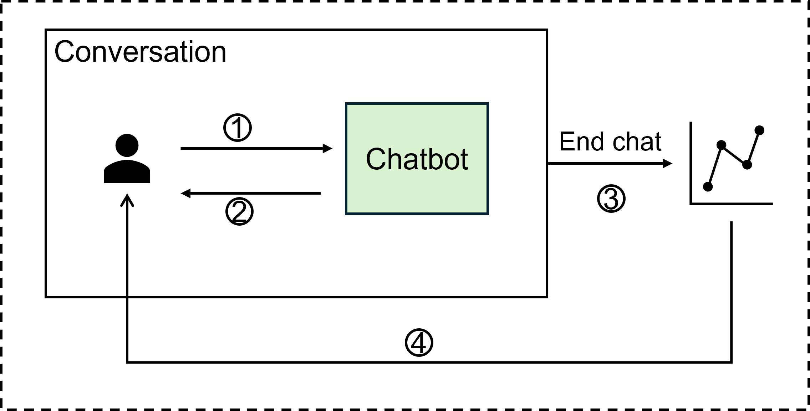
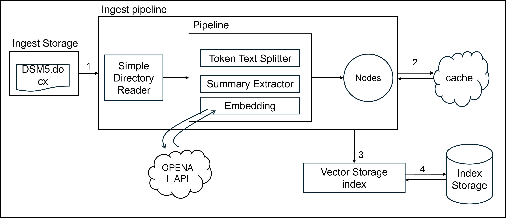
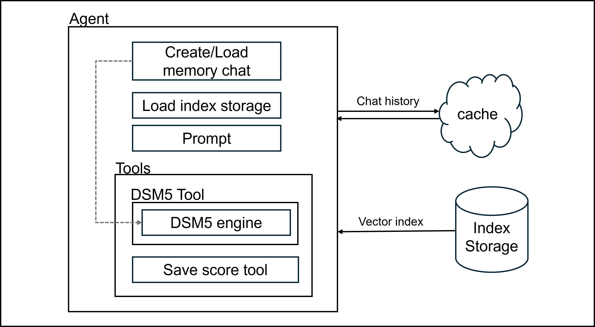
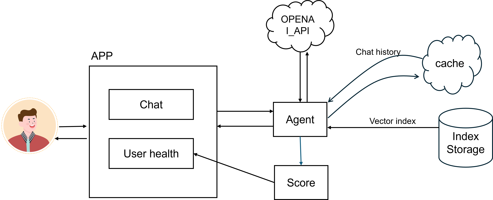
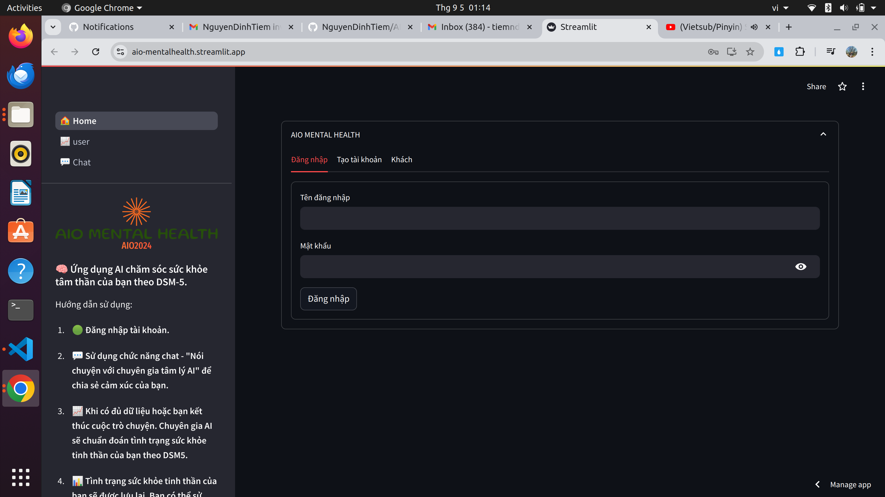
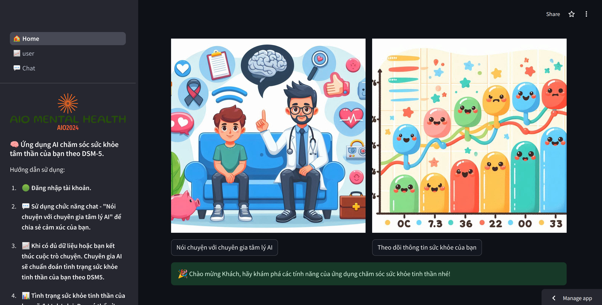
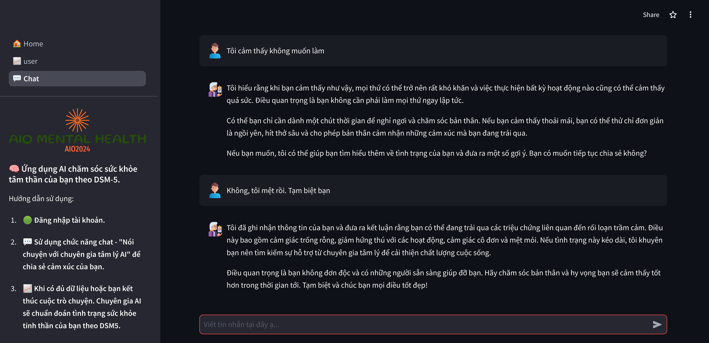
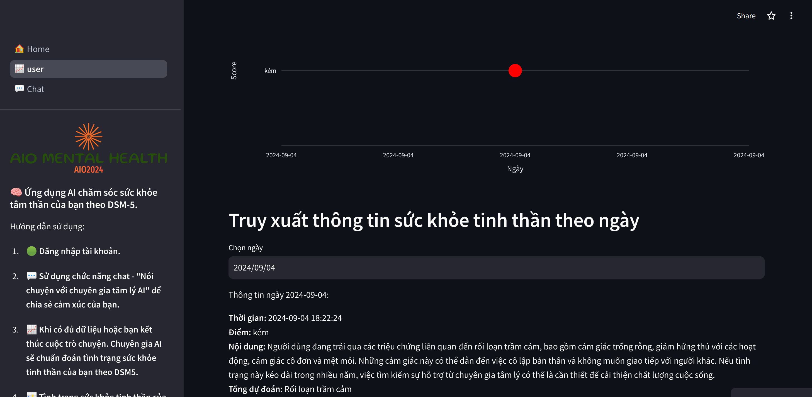

<p align="center">
  
</p>

# AIO MENTAL HEALTH - DỰ ÁN CHĂM SÓC SỨC KHỎE TINH THẦN CHO NGƯỜI VIỆT

## 1. Hướng dẫn cài đặt
### Tải mã nguồn về máy
```python
git clone https://github.com/NguyenDinhTiem/AIO-MENTAL-HEALTH.git
```
### Tạo môi trường và kích hoạt môi trường
```python
conda create -n aio_env python=3.11
conda activate aio_env
```
### Tạo OPENAI API KEY
Tạo thư mục /.streamlit/secrets.toml, nhập thông tin API vào file này.
```python
[openai]
OPENAI_API_KEY = "sk-your-api-key"
```
### Cài đặt các thư viện
```python
pip install -r requirements.txt
```
### Chạy ứng dụng
```python
streamlit run Home.py
```
### Để tinh chỉnh ứng dụng vui lòng xem hướng dẫn tại đây: 

2. Hệ thống





3. Demo
Bạn có thể trải nghiệm ứng dụng tại đây: https://aio-mentalhealth.streamlit.app/




